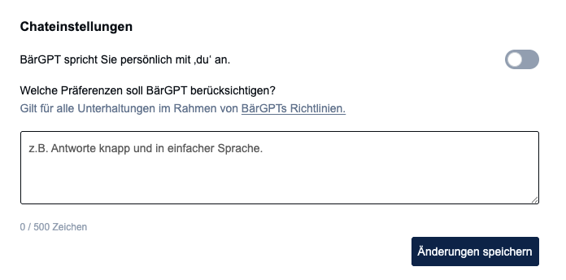

## 👤 Persönlicher Prompt
Hinterlege einen persönlichen Prompt, um Antworten dauerhaft an deine Arbeitsweise und deinen Aufgabenbereich anzupassen. Gehe dazu in dein Profil oben rechts und ändere ihn dann bei den Chateinstellungen. 

Release 1.9 · 8. Juli 2026
